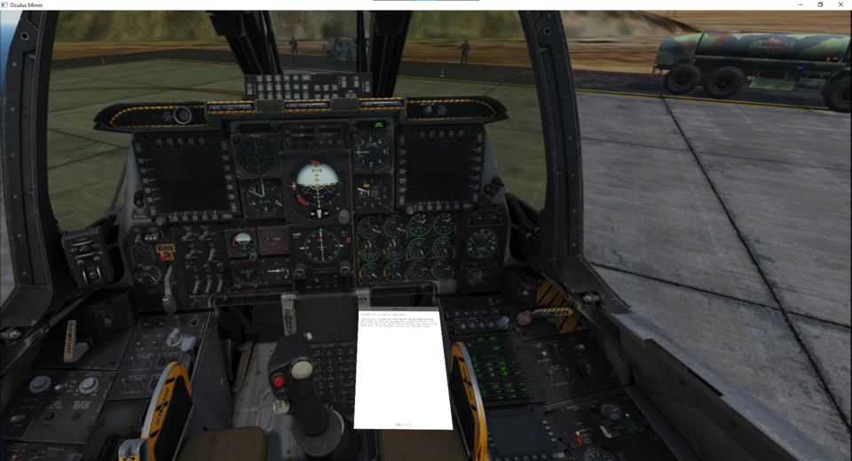
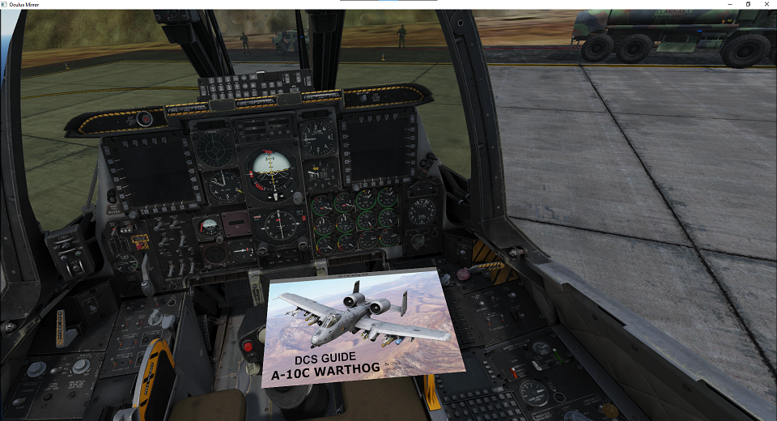
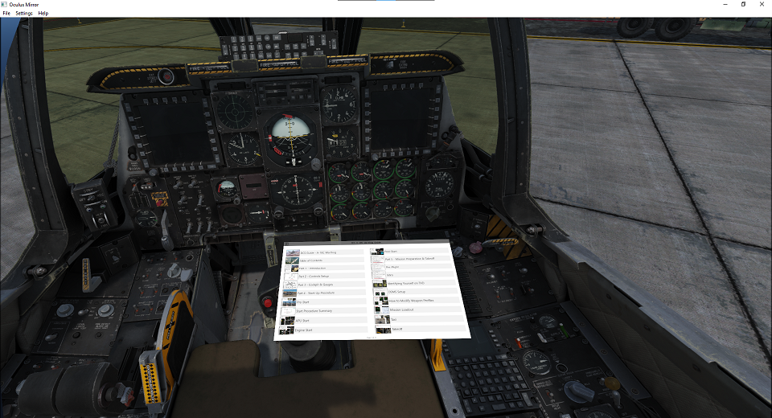
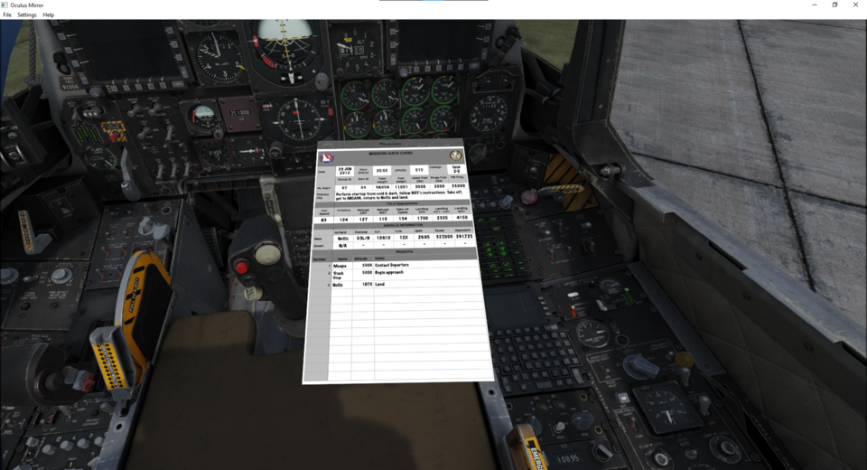
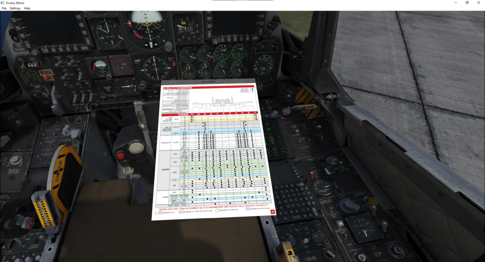

OpenKneeboard is an open source Kneeboard application, primarily aimed at virtual reality flight simulators, such as DCS World.

## WARNING: Anti-Cheat

While OpenKneeboard is not a cheat, it does hook into the games rendering and input pipelines, which over-eager anti-cheat systems may consider ban-worthy. While this is similar to how other overlays work (e.g. Steam and Discord), it is possible that using OpenKneeboard may lead to an anti-cheat ban.

Note that OpenKneeboard has **NO WARRANTY**; see [the LICENSE file](LICENSE) and [full text of the GPLv2](gpl-2.0.txt) for details.

## Getting Help

I make this for my own use, and I share this in the hope others find it useful; I'm not able to commit to support, bug fixes, or feature development.

Support may be available from the community via:

- [GitHub Discussions](https://github.com/fredemmott/OpenKneeboard/discussions)
- [Discord](https://discord.gg/CWrvKfuff3)

I am not able to respond to 1:1 requests for help via any means, including GitHub, Discord, Twitter, Reddit, or email.

## Requirements

- 64-bit Windows 10, Fall Creators Update (version 1709 or 10.0.16299) or newer
- A graphics card that supports Direct3D 11

Windows 11 is untested, and I am unable to investigate any issues reported with OpenKneeboard on Windows 11.

## Getting Started

1. Download [the latest release](https://github.com/fredemmott/OpenKneeboard/releases/latest)
2. Install it; the installer will offer to launch OpenKneeboard when finished.
3. Install the DCS hooks if prompted
4. Open settings
5. Add games to the 'Games' tab if they were not automatically added; this is needed for tablet, Oculus, and non-VR support
6. Configure your bindings

The hooks are optional, but are required for the DCS-specific tabs to work. If your DCS 'Saved Games' is not either `Saved Games\DCS` or `Saved Games\DCS.openbeta`, set the saved games path for the DCS entry in OpenKneeboard's saved games list.

If you are using a graphics tablet, non-VR, or Oculus, you must not run games (or any launchers, e.g. Skatezilla) as administrator/elevated.

You might also be interested in the documentation for:

* [Huion tablet users](docs/huion.md)
* [StreamDeck users](docs/streamdeck.md)
* [Wacom tablet users](docs/wacom.md)

### Adding Pages and Tabs To The Kneeboard

#### DCS Aircraft Tab

The aircraft tab reads from DCS's usual location: inside your DCS saved games folder (usually `Saved Games\DCS.openbeta` or `Saved Games\DCS`), add a `KNEEBOARD` folder. Within that, create another folder with the same name as the aircraft module folder from `Mods\aircraft` within your DCS installation folder. OpenKneeboard will load any image files - but not PDF or Lua files - in that folder. For example, I put my A-10C 2 images in `Saved Games\DCS.openbeta\KNEEBOARD\A-10C_2`.

Most kneeboard builders and 'how-to' guides/videos for DCS's built-in Kneeboard will work with OpenKneeboard.

### Other Tabs or Files

Additional tabs can be added via Settings -> Tabs -> Add Tab. PDFs must [currently](https://github.com/fredemmott/OpenKneeboard/issues/83) be added as separate tabs; the 'Folder' tab only supports normal image files.

## Features

### Graphics Tablet Support

Wintab-compatible graphics tablets are optionally supported; OpenKneeboard has been tested with Wacom Intuos S and Huion H640P tablets.

* [Huion instructions](docs/huion.md)
* [Wacom instructions](docs/wacom.md)

Write down 9-lines, do quick sketches, and use PDF bookmarks/tables of contents.

### DirectInput Joystick and Keyboard Support

Bind any of your device buttons (even if you have 128) to show/hide the kneeboard, previous tab, next tab, previous page, or next page.

### Attach to running games

Fits with your flow; no need to launch the games via OpenKneeboard, or to start OpenKneeboard first.

### VR? Non-VR? Either works.

### VR Zoom

Don't cloud your cockpit: goes out of the way when you're not looking at it.

### PDF Files

Add any PDF to your kneeboard:

Screenshot from [Chuck's A10C guide](https://www.mudspike.com/chucks-guides-dcs-a-10c-warthog/)

### PDF Navigation

If you have a wintab-compatible tablet, quickly jump to the page you want:

Screenshot from [Chuck's A10C guide](https://www.mudspike.com/chucks-guides-dcs-a-10c-warthog/)

If a PDF file contains bookmarks (often shown as a table of contents in the sidebar, you can jump to sections by clicking the 'Navigation' button in OpenKneeboard, or the 'menu' icon shown in-game with your graphics tablet pen.

Internals links in PDFs (e.g. in the table of contents in the first few pages) can also be 'clicked' with a graphics tablet pen.

### DCS Radio Log

A log of all radio messages that are shown by DCS World as text in the top left corner - there is no transcription. This is very useful for single player campaigns and close air support.

Screenshot from [Baltic Dragon's excellent Iron Flag campaign for the A-10C II](https://www.baltic-dragon.net/copy-of-a-10-tew-3-0).

### Categorized DCS Kneeboard

Quickly jump between sections:

#### Mission Tab

Screenshot from [Baltic Dragon's excellent Iron Flag campaign for the A-10C II](https://www.baltic-dragon.net/copy-of-a-10-tew-3-0).

#### Aircraft Tab

Screenshot from [Goldwolf's DCS Reference Guide](https://www.digitalcombatsimulator.com/en/files/3318384/)

#### Theater Tab

Field info etc

I believe these are currently only provided for the Caucasus and NTTR theaters.

### Not *just* for DCS

You can also add any other folder of images as another tab; this works great in DCS, or in other games.

## Supported Games

- Non-VR: DirectX 11
- OpenVR: any
- Oculus: DirectX 11, DirectX 12.
- OpenXR: DirectX 11, DirectX 12.

OpenKneeboard has been primarily tested with DCS: World Open Beta via the Oculus SDK, using DirectX 11.

## Thanks

- Paul 'Goldwolf" Whittingham for the logo and banner artwork.
- BeamRider for the [VRK](https://forums.eagle.ru/topic/211308-vrk-a-virtual-reality-enabled-kneeboard-with-touch-and-ink-support) project, for showing how useful an in-VR kneeboard is, and clear inspiration for OpenKneeboard.
- [Benjamin Höglinger-Stelzer a.k.a. Nefarius](https://nefarius.at/) for the [Injector](https://github.com/nefarius/Injector) utility, which has been extremely useful for development.
- Nefarius and the other members of the ViGEm Discord for lots of advice/feedback/information on DirectX, Detours, and other aspects of Windows development.
- [AMD GPUOpen's OCAT project](https://gpuopen.com/ocat/) for demonstrating overlay rendering in applications using the Oculus SDK.

## Developer Information

- This project is written in C++20
- It is built with CMake
- It is primarily developed with Visual Studio Code, using the compilers from Visual Studio 2022. Only the 'Build Tools for Visual Studio 2022' package is required, but 'Community Edition' or better also work fine.
- The UI is built with WinUI3, which currently requires msbuild instead of pure CMake.

For details on some internals, see [docs/internals/](docs/internals/).

## License

OpenKneeboard is licensed under the GNU General Public License, version 2.

This project uses several third-party libraries, which are used and distributed under their own license terms.
