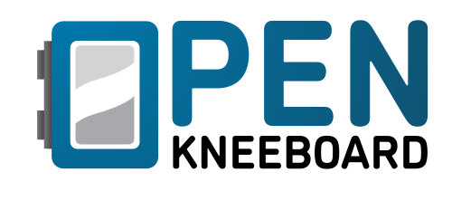
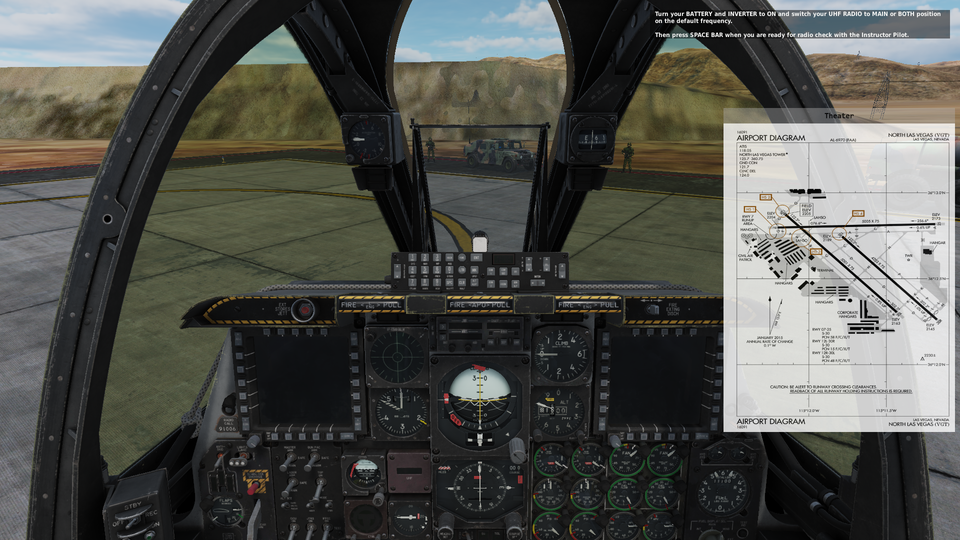

OpenKneeboard is a way to show reference information and take notes in games - especially flight simulators - including in VR. Taking notes requires a wintab-compatible graphics tablet.

## Getting Started

1. Download [the latest release](https://github.com/OpenKneeboard/OpenKneeboard/releases/latest)
2. Install it; the installer will offer to launch OpenKneeboard when finished.
3. Open settings
4. Add games to the 'Games' tab if they were not automatically added; this is needed for tablet, Oculus, and non-VR support
5. Configure your bindings; if you're playing in VR, you probably want to bind 'recenter' to the same buttons you use for the game.

You might also be interested in the documentation for:

* [Huion tablet users](docs/huion.md)
* [StreamDeck users](docs/streamdeck.md)
* [Wacom tablet users](docs/wacom.md)

## Getting Help

First, [check the troubleshooting guides](https://github.com/OpenKneeboard/OpenKneeboard/tree/master/docs/troubleshooting).

I make this for my own use, and I share this in the hope others find it useful; I'm not able to commit to support, bug fixes, or feature development.

Support may be available from the community via:

- [GitHub Discussions](https://github.com/OpenKneeboard/OpenKneeboard/discussions)
- [Discord](https://go.openkneeboard.com/discord)

I am not able to respond to 1:1 requests for help via any means, including GitHub, Discord, Twitter, Reddit, or email.

## Compatibility

- 64-bit Windows 10 May 2020 Update (version 2004 or 10.0.19041) or newer
- A graphics card that supports Direct3D 11

Windows 11 is untested, and I am unable to investigate any issues reported with OpenKneeboard on Windows 11.

### Notes and in-game toolbar

Taking notes and using the in-game toolbar requires a WinTab-compatible graphics tablet; common choices that are reported to work well include:

- Wacom Intuos S: fewest software issues, large recessed buttons are easy to find with the headset on
- Huion H640P: cheaper, more buttons

The following are **not compatible** with OpenKneeboard:

- Any XP-Pen tablets
- Any Gaomon tablets
- Any tablet computers, regardless of manufacturer; this includes Apple iPads, Microsoft Surface, etc.

### Games

- Non-VR: DirectX 11
- Oculus: DirectX 11, DirectX 12
- OpenVR: any
- OpenXR: DirectX 11, DirectX 12 (except Varjo)

OpenKneeboard has been primarily tested with DCS: World Open Beta via the Oculus SDK, using DirectX 11. Users report a good experience with:

* DCS with an HP Reverb G2 with SteamVR
* DCS with an HP Reverb G2 with OpenComposite
* DCS without VR
* MSFS with DX11 with various headsets
* MSFS with DX12 with various headsets (except Varjo)

Varjo support for games using DirectX 12 in combination with OpenXR is expected in OpenKneeboard v1.2.

**WARNING: Anti-Cheat**

While OpenKneeboard is not a cheat, it does hook into the games rendering and input pipelines, which over-eager anti-cheat systems may consider ban-worthy. While this is similar to how other overlays work (e.g. Steam and Discord), it is possible that using OpenKneeboard may lead to an anti-cheat ban.

Note that OpenKneeboard has **NO WARRANTY**; see [the LICENSE file](LICENSE) and [full text of the GPLv2](gpl-2.0.txt) for details.

## Thanks

- Paul 'Goldwolf" Whittingham for the logo and banner artwork.
- BeamRider for the [VRK](https://forums.eagle.ru/topic/211308-vrk-a-virtual-reality-enabled-kneeboard-with-touch-and-ink-support) project, for showing how useful an in-VR kneeboard is, and clear inspiration for OpenKneeboard.
- [Benjamin Höglinger-Stelzer a.k.a. Nefarius](https://nefarius.at/) for the [Injector](https://github.com/nefarius/Injector) utility, which has been extremely useful for development.
- Nefarius and the other members of the ViGEm Discord for lots of advice/feedback/information on DirectX, Detours, and other aspects of Windows development.
- [AMD GPUOpen's OCAT project](https://gpuopen.com/ocat/) for demonstrating overlay rendering in applications using the Oculus SDK.

## Developer Information

- This project is written in C++20
- It is built with CMake
- It is primarily developed with Visual Studio Code, using the compilers from Visual Studio 2022. Only the 'Build Tools for Visual Studio 2022' package is required, but 'Community Edition' or better also work fine.
- The UI is built with WinUI3, which currently requires msbuild instead of pure CMake.

For details on some internals, see [docs/internals/](docs/internals/).

## License

OpenKneeboard is licensed under the GNU General Public License, version 2.

This project uses several third-party libraries, which are used and distributed under their own license terms.

## Screenshots

