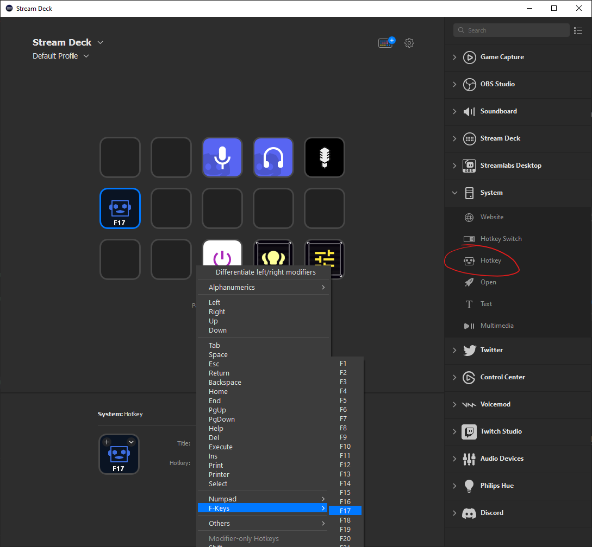
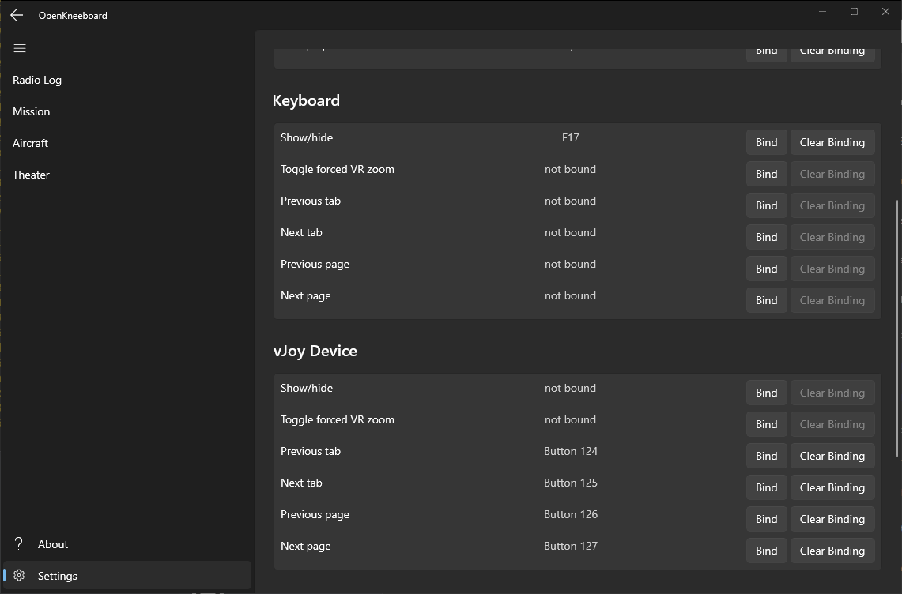
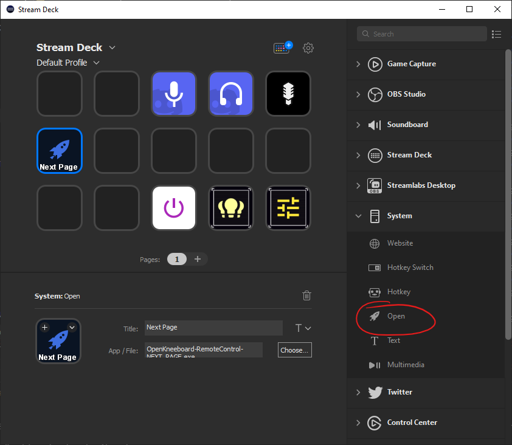

# Elgato StreamDeck

A StreamDeck can be used for basic control, e.g. selectinging pages and tabs, or showing and hiding the kneeboard. There are two ways to do this:

## HotKeys

Use the 'System' -> 'HotKey' StreamDeck action, then assign a keystroke combination that does not conflict with anything else you're using keystrokes for (including your in-game keybinds).

F17-24 are particularly useful for this, as they do not exist on most keyboards, fully supported by DirectInput,  and are rarely used by other software:

Once this is done, you can bind it through Settings -> DirectInput -> Keyboard in OpenKneeboard:

## Remote Controls

This needs a bit more work to set up, but you don't need to worry about finding a unique key combination.

`C:\Program Files\OpenKneeboard\utilities` contains several remote control executables that can be used with StreamDeck's "Open" action, for example:

For a complete list and more details, check out [remote controls](./remote-controls.md).

Use the 'System' -> 'Open' StreamDeck action, then browse to the application you want. For example, if you want a StreamDeck key to move to the next kneeboard page, select `OpenKneeboard-RemoteControl-NEXT_PAGE.exe`:

For remote controls with parameters, add a space after the closing quotation mark, then add the parameters - for example:

> "C:\Program Files\OpenKneeboard\utilities\OpenKneeboard-RemoteControl-SET_TAB.exe" name "Radio Log"

... or ...

> "C:\Program Files\OpenKneeboard\utilities\OpenKneeboard-RemoteControl-SET_TAB.exe" id "{8e882d1e-de80-4b35-9388-f41a01d94a3d}"

This example ID will not be valid on your installation.
