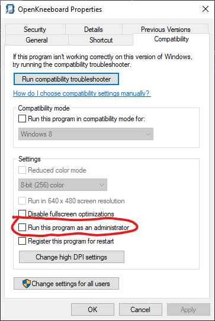
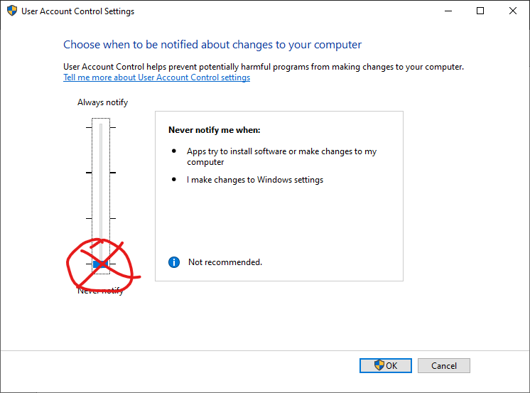

# Administrator and UAC

{: .no_toc }

OpenKneeboard does not support running as administrator, or with User Account Control (UAC) turned off.

1. TOC
{:toc}
2. 
## Launchers

e.g. Stream Deck or Voice Attack

If you are running these as administrator, everything they launch will run as administrator.

If the software has an option to launch things without administrator privileges, you can try using that. If OpenKneeboard still detects that it is running as administrator, contact support for the launcher software you are using.

## Shortcuts

If you are launching OpenKneeboard through a shortcut, make sure that "Run this progam as an administrator" is **not** checked in the shortcut's compatibility settings:

## User Account Control

The bottom setting is misleadingly labelled and has a much larger effect than it sounds: Windows will not just stop prompting you, it will automatically run more things as Administrator. This can damage your system in ways that can only reasonably be repaired by reinstalling Windows.

OpenKneeboard allows any setting except the bottom value; however, if you have *ever* had UAC turned off, you should expect problems with your games, VR drivers, tablet drivers, OpenKneeboard, and other software/hardware on your system until you reinstall Windows.

## Why is this a problem?

- there are [known crash-causing bugs that can only be fixed by Microsoft](https://github.com/microsoft/microsoft-ui-xaml/issues/7690)
- running software as administrator - or worse, with UAC turned off - can cause problems with other applications, including the operating system itself, which can only be fixed by reinstalling Windows
    - among other problems, it can change permissions so that in the future, you *must* run as OpenKneeboard
    - when combined with the known-crash-causing-bugs that can only be fixed by Microsoft, this gets you in a situation where you "must" run as Administrator, but you also "must not". The only way to avoid these issues are to never run as Administrator
- even if there weren't these concrete issues, I am not willing to spend any more of my free time looking into issues that are caused by a configuration that has been discouraged since 2007, and is a bad idea.

**This is not specific to OpenKneeboard** - on modern Windows, turning off UAC
running any application as Administrator that is not intended to be ran as administrator is more likely to cause problems than fix them.

The most common issue that running as administrator 'fixes' is that the program was previously ran as administrator.

The only way to resolve these issues is *not* to run OpenKneeboard as administrator. **If OpenKneeboard says `[Administrator]` but you are not intentionally running *anything* as administrator**, check out the [User Account Control](#user-account-control) section.

## Why can't I choose to run it as administrator anyway?

I tried very obtrusive warnings, which told people:

- their configuration is unsupported
- their configuration has known problems
- not to ask for help
- not to report any issues

These messages were widely ignored, and in some cases, led to users lying about their configuration, wasting all of our time.

I refuse to spend any more of my time on these issues.

## I heard things work better as Administrator or with UAC off

This was true for *some* software that was made for Windows 95 and not updated since Windows Vista. It is actively harmful for most modern Windows software.

Turning UAC off or running normal user programs as Administrator has been bad advice since roughly 2010.

## I just want to run it as Administrator once to see if it fixes things

This doesn't fix problems; instead, it can cause problems that can only reasonably be fixed by reinstalling Windows. This can include making it so that other software won't work except as Administrator.

This is true for almost all modern Windows software; there are very few exceptions.

## I turned UAC back on, but I still get a warning. How do I stop getting these warnings?

Reinstall Windows.

Turning UAC off frequently causes problems that are only reasonably fixed by reinstalling Windows.

## Will you remove the requirements or messages?

No.

## Please reconsider.

No.

