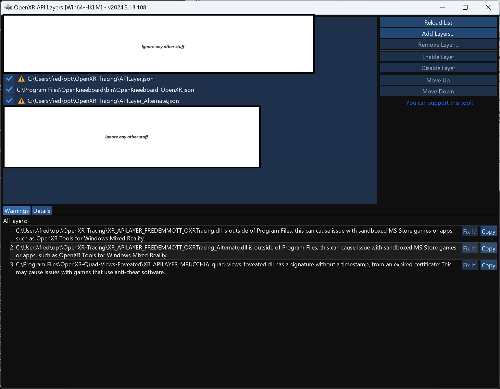

# Logs and Traces

## Saving Debug Logs

First, make sure the logs contain the start of the problem:

1. Close OpenKneeboard and the game
2. Start OpenKneeboard
3. Start the game
4. Wait for the problem to occur

Then, save the logs:

1. Open OpenKneeboard's Help page
2. Expand the 'Debugging Information' section
3. Read and agree to the disclaimer
4. Click 'Save all as...'
5. Share the created zip either in a new thread the `#openkneeboard-help` Discord channel or new GitHub issue, along with a description of the problem.

Normally, when you start OpenKneeboard does not matter; for log collection it does, as we want the OpenKneeboard log to contain the game's startup.

## Standard Traces

These contain much more detail than the standard logs; they may affect performance of the game, but are required for diagnosing most performance issue, along with particularly complicated non-performance issues. You only need to collect a trace if you are asked for one.

1. Close OpenKneeboard and the game
2. Start an administrator command prompt or terminal; for example
  1. Open the start menu
  2. Type 'command prompt' but don't hit enter
  3. Hit command+shift+enter
  4. Press 'yes' if Windows prompts you for permission
3. In the administrator command prompt, copy-paste `wpr -start "C:\Program Files\OpenKneeboard\scripts\OpenKneeboard.wprp" -filemode` and hit enter
4. Start OpenKneeboard
5. Start the game
6. Wait for the problem to occur
7. In the administrator command prompt, copy-paste `wpr -stop trace.etl`
8. Also [save the debug logs](#saving-debug-logs)
9. Share the debug logs zip and the `trace.etl` file in a new thread in the `#openkneeboard-help` Discord channel or a new Github issue, along with a description of the problem. 

## Detailed OpenXR Traces

These contain the same information as the standard traces, in addition to information on exactly how the game and OpenKneeboard are using OpenXR. You only need to collect a detailed OpenXR trace if you are asked for one.

1. Download the msvc-x64 [OpenXR-Tracing](https://github.com/fredemmott/OpenXR-Tracing/releases/latest), and extract it somewhere handy
2. Download the [OpenXR API Layers GUI](https://github.com/fredemmott/OpenXR-API-Layers-GUI/releases/latest), and extract it somewhere handy
3. Run `OpenXR-API-Layers-Win64-HKLM.exe`
4. `OpenXR-Tracing` contains two JSON files, `APILayer.json` and `APILayer_Alternate.json`; add them in the layers tool, and position `APILayer.json` immediately above OpenKneeboard, and `APILayer_Alternate.json` immediately below OpenKneeboard
5. Make sure the layers are enabled (ticked); you should see something like the image below
6. Collect the trace in the same way as a [standard trace](#standard-traces)
7. When done, you probably want to disable or remove the tracing layers

